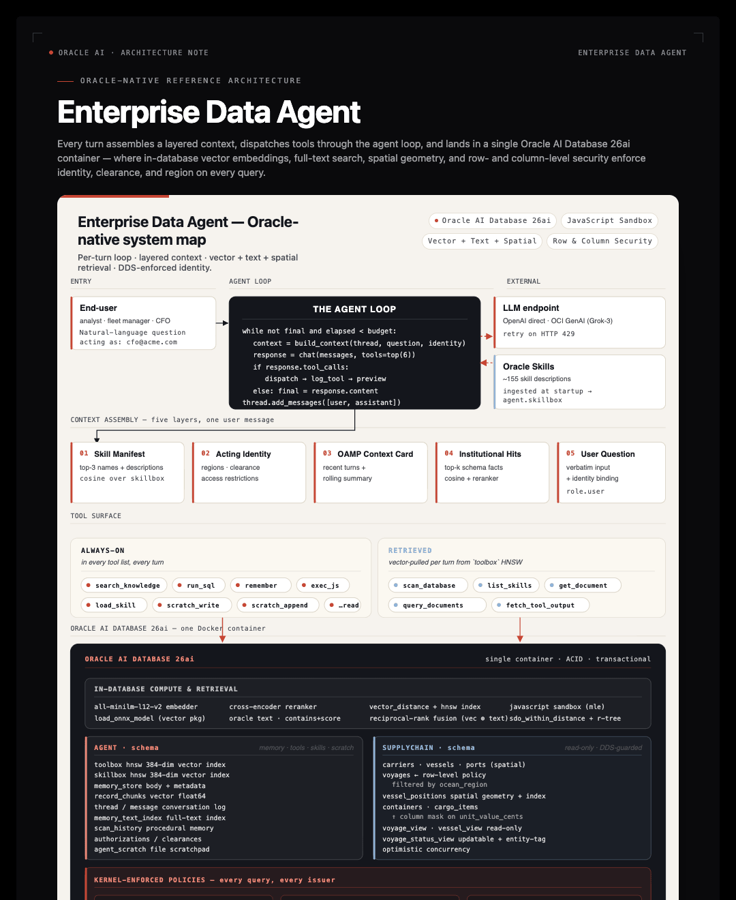
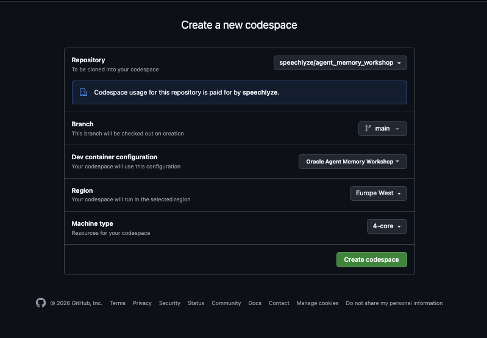
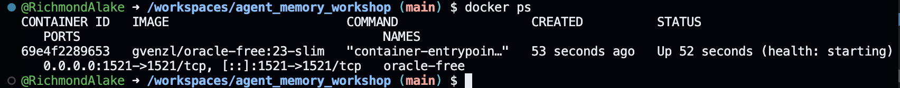
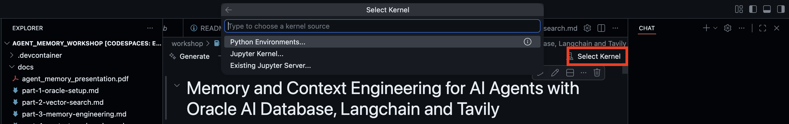

# Enterprise Data Agent Workshop

**Build a memory-aware enterprise data agent on Oracle AI Database 26ai — then see it running in a real chat UI.**

[](https://codespaces.new/speechlyze/enterprise-data-agent-harness-workshop-lightweight)

---

## What You Will Build (and Run)

> **From notebook concept to running application.** You build the harness in the notebook, primitive by primitive. The Codespace already has the *same* harness running as a Flask + React app on the *same* Oracle — open it at [http://localhost:3000](http://localhost:3000) and watch the concept you're coding become a live product. The notebook teaches the pattern; the app shows it deployed.

This workshop is two halves of the same thing:

1. **The notebook** (`workshop/notebook_student.ipynb`) — you build the harness from primitives. Long-term memory via OAMP, hybrid vector + Oracle Text retrieval, an HNSW-indexed `toolbox`, the `agent_turn` loop, JSON Relational Duality Views, tool-output offload. **9 focused coding TODOs across 11 parts**, ~1 hour.

2. **The app** (`app/`) — a Flask + React reference deployment of the *same* harness against the *same* Oracle, same OAMP store, same `toolbox` and `skillbox` the notebook populates. Chat UI on the left, live-updating memory pane on the right, 3D globe the agent can drive via tool calls. The Codespace boots the app for you on first launch and auto-opens the browser preview at `http://localhost:3000` — every harness piece you build in the notebook is wired up live in this app.

The notebook is **11 parts with 9 hands-on coding TODOs**. Every "true setup" task — `AGENT` user creation, vector memory allocation, ONNX model loading, the `SUPPLYCHAIN` seed, JSON Relational Duality View DDL — is run by the Codespace **before** you open the notebook (`app/scripts/bootstrap.py`, `seed.py`, `setup_advanced.py`). Each TODO has a hard-stop assert below it so a broken implementation surfaces immediately. Three notebooks ship:

| Notebook | When to open |
|---|---|
| [`notebook_student.ipynb`](workshop/notebook_student.ipynb) | Your working notebook — 9 TODO stubs, asserts that fail loudly if a TODO is wrong |
| [`notebook_complete.ipynb`](workshop/notebook_complete.ipynb) | TODO solutions filled in; everything else is the same |
| [`notebook_complete_with_setup_code.ipynb`](workshop/notebook_complete_with_setup_code.ipynb) | Full source including all Oracle DDL — useful when you want to deploy against an Oracle that *isn't* the workshop Codespace |

The whole loop is roughly 300 lines of Python; the rest is database primitives.



## The Learning Path

| Step | What you do | Where |
|---|---|---|
| 1 | Wait for the Codespace to finish auto-bootstrapping (Oracle, ONNX models, SUPPLYCHAIN seed, duality views, skillbox, app) | Codespace terminal |
| 2 | Read the [Part 1 guide](docs/part-1-setup.md), then open `workshop/notebook_student.ipynb` | Notebook |
| 3 | Work through TODOs 1–9 — each has a hard-stop assert below it | Notebook |
| 4 | Open the running chat UI at `http://localhost:3000` | Browser preview |
| 5 | Try the starter prompts (below) — every harness piece you just built is wired up live | Browser preview |
| 6 | Read [`app/README.md`](app/README.md) for the full app architecture | Browser |

## Workshop Parts

| Part | Topic | Guide | Coding TODO? |
|---|---|---|---|
| 1 | Setup & connectivity | [Part 1](docs/part-1-setup.md) | — |
| 2 | Long-term memory with OAMP + scanner | [Part 2](docs/part-2-oamp-memory.md) | **TODO 1** — `_scan_tables` |
| 3 | Retrieval (vector + hybrid RRF) | [Part 3](docs/part-3-retrieval.md) | **TODO 2** — `retrieve_knowledge`<br>**TODO 3** — `hybrid_rrf_search_memories` |
| 4 | DBFS scratchpad | [Part 4](docs/part-4-dbfs.md) | — |
| 5 | Oracle MLE compute sandbox | [Part 5](docs/part-5-mle.md) | — |
| 6 | Tools & skills (vector-indexed registries) | [Part 6](docs/part-6-tools-and-skills.md) | **TODO 4** — `tool_run_sql` |
| 7 | The agent loop | [Part 7](docs/part-7-agent-loop.md) | **TODO 5** — `agent_turn` |
| 9 | JSON Relational Duality Views | [Part 9](docs/part-9-duality-views.md) | **TODO 7** — `tool_get_document` |
| 11 | Tool-output offload | [Part 11](docs/part-11-tool-output-offload.md) | **TODO 8** — `log_tool`<br>**TODO 9** — `tool_fetch_tool_output` |

> **[TODO Checklist](docs/TODO-checklist.md)** — 9 coding TODOs at a glance, each with a hard-stop assert checkpoint.

## Getting Started

### Option A: GitHub Codespaces (recommended — app auto-starts)

1. Click the **Open in GitHub Codespaces** badge above.

2. Click **Create Codespace** to launch.

   

3. **Wait ~5 minutes for the auto-build.** The Codespace runs three things in sequence:

   - `setup_build.sh` — installs Python deps (workshop notebook + app backend) and `npm install` for the frontend.
   - `setup_runtime.sh` — boots Oracle, runs `app/scripts/bootstrap.py` (AGENT user, vector pool, ONNX embedder, DBFS), then `app/scripts/seed.py` (SUPPLYCHAIN, duality views, ingest `oracle/skills` into the skillbox).
   - `start_app.sh` — starts the Flask backend on `:8000` and the Vite dev server on `:3000`.

   

4. **The app opens automatically** in a browser preview on port 3000 (`portsAttributes.3000.onAutoForward = "openPreview"`). If it doesn\'t, click the **PORTS** tab at the bottom of VS Code and open the forwarded port 3000 URL.

5. Verify Oracle is healthy (in the terminal):

   ```bash
   docker ps
   ```

   You should see `(healthy)` for the `oracle-free` container.

   

6. **Open the workshop notebook** to start the build. The auto-attach picks `workshop/notebook_student.ipynb` for you. Select the **Python 3.11** kernel:

   

7. Follow the notebook cells top to bottom. Use the part guides in `docs/` when you hit a TODO. Check off tasks against the [TODO checklist](docs/TODO-checklist.md).

8. When you finish the notebook, head to the **app preview tab** at `http://localhost:3000` and try the starter prompts below. Every harness piece you just built is wired up there.

> **First-run note:** The first auto-bootstrap can take 5–8 minutes (Oracle Free image is ~3 GB and the ONNX embedder is ~117 MB). Subsequent Codespace opens are ~30 seconds — `start_app.sh` just brings the app back up against the existing Oracle volume.

### App preview shows "HTTP ERROR 502" or "This page isn't working"

`502` from `*.app.github.dev:3000` means port 3000 isn't serving yet — either the Vite dev server hasn't bound, the Flask backend (`:8000`) crashed during init, or you clicked the preview before `start_app.sh` finished. In a Codespace terminal:

```bash
# What's actually running?
ps aux | grep -E "(python app.py|vite|npm.*dev)" | grep -v grep

# Logs (look at the last error)
tail -60 .devcontainer/logs/backend.log
tail -40 .devcontainer/logs/frontend.log

# Most-common fix — just re-run the start script
bash .devcontainer/start_app.sh
```

If the backend log shows an Oracle connection error, the bootstrap step probably didn't finish:

```bash
bash .devcontainer/setup_runtime.sh    # idempotent — re-runs bootstrap + seed + advanced setup
bash .devcontainer/start_app.sh
```

If the backend log shows `OPENAI_API_KEY is None` or an `AuthenticationError`, the Codespace doesn't have an LLM key set. Add one:

```bash
echo 'OPENAI_API_KEY=sk-...' >> app/.env
bash .devcontainer/start_app.sh
```

For permanent fixes, add `OPENAI_API_KEY` (or `OCI_GENAI_API_KEY`) as a [Codespaces secret](https://github.com/settings/codespaces) and rebuild the Codespace.

### Option B: Local development

```bash
git clone https://github.com/speechlyze/enterprise-data-agent-harness-workshop
cd enterprise-data-agent-harness-workshop

# 1. Start Oracle AI Database (Docker, ~3 min on first run)
docker compose -f .devcontainer/docker-compose.yml up -d oracle

# 2. Install workshop notebook deps + app backend deps
pip install -r requirements.txt
pip install -r app/backend/requirements.txt

# 3. Configure secrets
cp app/.env.example app/.env       # OCI is the default — fill OCI_GENAI_API_KEY

# 4. One-time database setup — RUN ALL THREE, in order
cd app
python scripts/bootstrap.py        # AGENT user, vector pool, ONNX embedder, DBFS
python scripts/seed.py             # SUPPLYCHAIN schema + seed + JSON Duality Views
python scripts/setup_advanced.py   # Oracle Text index
cd ..

# 5. Install the frontend
cd app/frontend && npm install && cd ../..

# 6a. Run the notebook
jupyter lab workshop/notebook_student.ipynb

# 6b. (When you finish the notebook) start the app — two terminals
cd app/backend && python app.py            # backend  → :8000
cd app/frontend && npm run dev             # frontend → :3000
```


**Verify the setup landed** before opening the notebook:

```bash
python -c "
import os, oracledb
c = oracledb.connect(user='sys', password=os.environ.get('ORACLE_SYS_PASS','OraclePwd_2025'),
                     dsn=os.environ.get('ORACLE_DSN','localhost:1521/FREEPDB1'),
                     mode=oracledb.SYSDBA)
with c.cursor() as cur:
    cur.execute(\"SELECT COUNT(*) FROM dba_policies WHERE object_owner='SUPPLYCHAIN'\")
"
```

## Running the App (after the notebook)

The Codespace starts the app for you automatically. If you stopped it or you\'re running locally:

```bash
# Terminal 1
cd app/backend && python app.py

# Terminal 2
cd app/frontend && npm run dev
```

Open `http://localhost:3000`.

### Starter prompts

Drop these into the chat to exercise different parts of the harness you just built:

| Prompt | What it exercises |
|---|---|
| *"What\'s in the SUPPLYCHAIN schema? Briefly list the entities and relationships."* | Scanner-built institutional knowledge (Part 2) |
| *"How many active voyages does each carrier currently have?"* | `run_sql` + the agent loop (Part 6 + Part 7) |
| *"Which vessels are within 1500 km of Singapore right now?"* | Oracle Spatial — `SDO_WITHIN_DISTANCE` against `vessel_positions.position` |
| *"Pull the lat/long of every in-transit vessel and use exec_js to compute the haversine distance from the fleet centroid for each. Tell me the farthest one."* | `run_sql` → `exec_js` (Oracle MLE) — JavaScript inside the database |
| *"Give me the complete document for voyage 7 — vessel, carrier, ports, containers, cargo. Use the duality view if there is one."* | `get_document("voyage_dv", "7")` — JSON Relational Duality Views |
| *"Show me all voyages currently in MEDITERRANEAN with cargo above 100k USD declared value."* | `query_documents("voyage_dv", where=...)` |
| *"How do I diagnose ORA-00904? Consult any guide you have."* | `load_skill("agent/ora-error-catalog")` from the skillbox |

The right-hand pane fills in after every turn — top semantic memories, recent tool outputs, skill manifest, token usage. That\'s the same OAMP store you populated in Part 2 of the notebook.

For full app docs, see [`app/README.md`](app/README.md).

## Workshop Files

```
enterprise-data-agent-workshop/
├── .devcontainer/                  Codespaces auto-bootstrap
│   ├── devcontainer.json           Forwards 1521/8000/3000; pre/post commands
│   ├── docker-compose.yml          Oracle Free 23-slim
│   ├── setup_build.sh              onCreate — pip + npm installs
│   ├── setup_runtime.sh            postCreate — Oracle + bootstrap + seed + advanced setup
│   └── start_app.sh                postStart — backend + frontend in background
├── workshop/
│   ├── notebook_student.ipynb              Your working notebook (9 TODO stubs + asserts)
│   ├── notebook_complete.ipynb             TODO solutions filled in
│   └── notebook_complete_with_setup_code.ipynb   Full source including Oracle DDL
├── docs/
│   ├── part-1-setup.md
│   ├── part-2-oamp-memory.md
│   ├── part-3-retrieval.md
│   ├── part-4-dbfs.md
│   ├── part-5-mle.md
│   ├── part-6-tools-and-skills.md
│   ├── part-7-agent-loop.md
│   ├── part-9-duality-views.md
│   ├── part-11-tool-output-offload.md
│   ├── TODO-checklist.md
│   └── troubleshooting.md
├── app/                            Flask + React reference deployment
│   ├── README.md                   Full app architecture
│   ├── .env.example                Copy to .env and fill in keys
│   ├── backend/                    Flask + Socket.IO + the harness
│   ├── frontend/                   React + Vite + Tailwind UI
│   └── scripts/
│       ├── bootstrap.py            AGENT user, vector pool, ONNX, DBFS, empty toolbox/skillbox
│       ├── seed.py                 SUPPLYCHAIN schema + duality views + skillbox ingestion + scan
│       └── setup_advanced.py       Oracle Text index
├── images/                         Architecture diagrams + screenshots
├── enterprise_data_agent.ipynb     Original source notebook (181 cells; mirrored by notebook_complete_with_setup_code.ipynb)
├── requirements.txt                Workshop notebook deps
└── README.md                       (this file)
```

## Stack

- **Oracle AI Database 26ai Free** via `gvenzl/oracle-free:23-slim`.
- **`oracleagentmemory`** — Oracle AI Agent Memory Package (OAMP). Owns the long-term memory schema.
- **`oracledb`** — official Python Oracle driver.
- **In-database ONNX embedder** (`all-MiniLM-L12-v2`, 384-dim) loaded via `DBMS_VECTOR.LOAD_ONNX_MODEL`. No hosted embedding API.
- **In-database ONNX cross-encoder reranker** (`bge-reranker-base`) called via `PREDICTION()`.
- **`openai` SDK** — pointed at OpenAI directly or OCI GenAI\'s OpenAI-compatible endpoint via `LLM_PROVIDER`.
- **App**: Flask + Socket.IO + eventlet (backend); React 18 + Vite + Tailwind + react-globe.gl (frontend).

## What is "an agent" in this workshop?

```
Agent = Model + Harness
```

The model emits tokens. Everything else — state, memory, tool dispatch, identity, retry logic, budgets — is harness code. Most "agent quality" complaints are harness problems, not model problems.

The harness you build:

- Stores memories in Oracle (long-term: OAMP; procedural: `scan_history`).
- Embeds and retrieves via in-DB SQL (`VECTOR_EMBEDDING`, `PREDICTION`, `CONTAINS`).
- Dispatches tools registered with a single decorator that introspects the function and writes a vector-indexed row.
- Runs the loop in 90 lines of Python.

The app proves it: those same 90 lines (lifted into `app/backend/agent/harness.py`) drive a real chat UI against the same Oracle, with end-user identity, live memory pane, and a 3D globe that the agent can drive via `focus_world`.

## Where to Next?

- **[Oracle AI Agent Memory Package](https://www.oracle.com/database/ai-agent-memory/)** — full OAMP documentation.
- **[Oracle AI Developer Hub](https://github.com/oracle-devrel/oracle-ai-developer-hub)** — more technical assets, samples, and projects.
- **[`oracle/skills`](https://github.com/oracle/skills)** — the skill library that seeds the skillbox (used in Part 6).
- **[`workshop/notebook_complete_with_setup_code.ipynb`](workshop/notebook_complete_with_setup_code.ipynb)** — the full-source 105-cell notebook including every Oracle DDL. Open this when you want to deploy the harness against an Oracle that isn\'t the workshop Codespace.

---

Built for the Oracle AI Developer Experience team.
