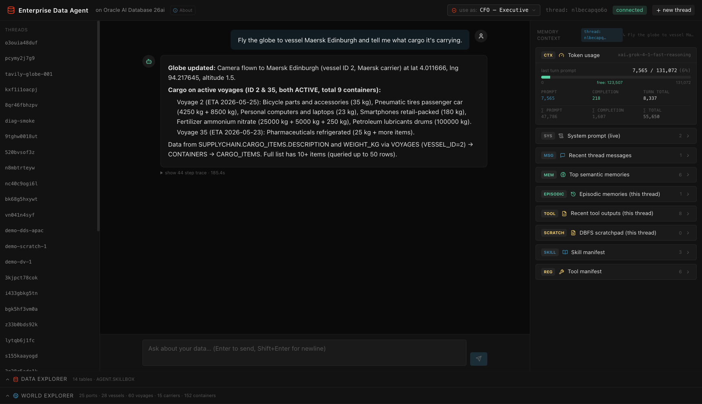
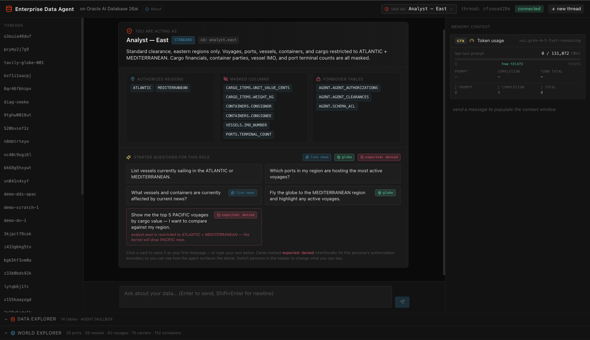
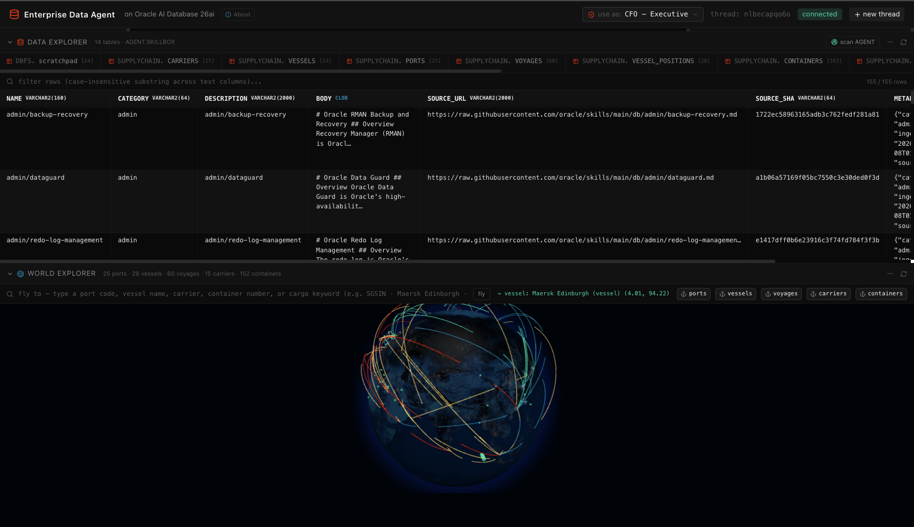

# Enterprise Data Agent — Supply Chain Demo

A chat UI for the agent harness built in `enterprise_data_agent.ipynb`. Same harness, same Oracle 26ai database, but exposed through a Flask + Socket.IO API and a React + Vite + Tailwind front-end.


*Asking the agent to fly the globe to a vessel and report its cargo. Left rail: thread list. Centre: the assistant's grounded answer with a "show 44 step trace" link. Right pane: live `Token usage` meter (last-turn prompt vs. model-max), system prompt, recent thread messages, top semantic memories, episodic memories, recent tool outputs, DBFS scratchpad, skill manifest, tool manifest — all scoped to the active thread.*

**Demo domain:** a global container-shipping operation. The `SUPPLYCHAIN` schema models 15 carriers, 25 ports (with `SDO_GEOMETRY` lat/long), 30 vessels, 60 voyages across four ocean regions, current AIS positions for the active fleet, ~150 containers in transit, and ~300 cargo items with HS codes, declared values, and weights. The agent answers questions over all of it via SQL, spatial queries (`SDO_WITHIN_DISTANCE`), in-database compute (Oracle MLE), JSON Relational Duality Views, and identity-aware row/column filtering (DDS / DBMS_RLS).

## What this application teaches

This app is a working reference for building a **production-shaped agent harness** on top of Oracle AI Database 26ai. Every screen and every tool corresponds to a concept you'd otherwise have to assemble from a half-dozen disjoint services. Read it twice and you'll have a working mental model for shipping enterprise AI agents that don't leak data, don't hallucinate schemas, and don't crumble when a model rejects authentication.

### 1. The agent harness pattern: `Agent = Model + Harness`

The chat loop in `agent/harness.py` is ~100 lines of Python. Read it once and you understand the entire control flow: build a context (skill manifest + OAMP context card + retrieved schema facts + persona block), retrieve top-k tools by vector similarity over `toolbox`, call the LLM, dispatch any tool calls, offload full outputs to OAMP and inline a compact reference back into the prompt, repeat until the model returns plain text or the budget runs out, then guard-stop with a forced finalization. **No planner, no router, no sub-agent spawning.** The model picks the path; the harness owns state integrity.

You'll learn:

- Why the harness should "guide the goal, not the path" (system prompt + tool schemas + budget — let the model choose).
- How to keep state integrity out of the model's hands while still letting it author SQL, run sandboxed JS, and write to a scratchpad.
- How tool-output offloading + truncation markers (`...[+N bytes; full: fetch_tool_output(tool_call_id='...')]`) keep context windows manageable across long threads.
- How to structure a tool-call loop so the LLM can transparently fall back across providers mid-turn (OCI → OpenAI gpt-5.5 if OCI auth fails — see `agent/llm.py`).

### 2. Identity-aware authorization (the "Use As:" selector)

The trust boundary follows the **end user**, not the database connection. Pick a persona in the header and the same SQL returns different data:

| Persona | Clearance | Regions | Effect |
|---|---|---|---|
| `agent` (default) | STANDARD | all | financials masked + admin tables forbidden |
| `cfo` | EXECUTIVE | all | full visibility |
| `analyst.east` | STANDARD | ATLANTIC + MEDITERRANEAN | regional row filter + financials masked |
| `analyst.west` | STANDARD | PACIFIC + INDIAN | regional row filter + financials masked |
| `ops.viewer` | STANDARD | all | cargo/container tables forbidden + commercial cols masked |

You'll learn:

- The same access-control shape DDS (Deep Data Security) ships at the kernel level in 26ai — declarative row policies, column masks, forbidden tables — but expressed in the application layer for a self-contained demo.
- How to wire identity through *both* the data explorer (REST) and the chat agent (`tool_run_sql` post-fetch row-drop, column mask, forbid-table refusal) using a per-turn `threading.local`.
- How to make denials *useful*: when the agent hits a forbidden table, it tells the user the persona name, the missing privilege, and which higher-clearance persona would unblock the query. No generic "access denied" — every denial is grounded in a named role.
- The starter-prompt **"expected: denied"** chips on the welcome mat let you click straight into a deny path so you can see the boundary in action.


*Welcome mat shown on every fresh thread: the active persona's clearance, authorized regions, masked columns, and forbidden tables are visible at a glance. Starter prompts are tagged — `live news` cards fire `search_tavily`, `globe` cards drive the World Explorer, and the red `expected: denied` card is calibrated to hit this persona's authorization wall (here, `analyst.east` asking for PACIFIC voyages — the kernel will drop the rows). Switch persona from the header chip and the entire mat redraws.*

### 3. The Oracle AI Database 26ai primitive set, in one app

The harness is deliberately built from primitives the database already ships, so you can read each integration end-to-end:

| Concept | Implementation surface |
|---|---|
| `VECTOR(384, FLOAT32)` columns | `toolbox`, `skillbox`, OAMP-managed memory tables |
| HNSW vector indexes (`ORGANIZATION INMEMORY NEIGHBOR GRAPH`) | `toolbox_emb_v`, `skillbox_emb_v`, OAMP indexes |
| `vector_memory_size` pool | `db/vector_pool.py`, `scripts/bootstrap.py` allocates 512M |
| In-database ONNX embeddings | `DBMS_VECTOR.LOAD_ONNX_MODEL` of `all-MiniLM-L12-v2`, queried via `VECTOR_EMBEDDING(... USING :t AS DATA)` |
| Cross-encoder reranker (optional) | Same `DBMS_VECTOR.LOAD_ONNX_MODEL` mechanism + `PREDICTION(reranker USING :q AS DATA1, doc AS DATA2)` |
| `VECTOR_DISTANCE(..., COSINE)` | top-k retrieval in every tool/skill/memory query |
| Oracle MLE (JavaScript in the kernel) | `agent/mle.py` wraps `DBMS_MLE.CREATE_CONTEXT/EVAL/IMPORT_FROM_MLE`; agent uses it for percentiles, stats, unit conversions |
| DBFS (Database File System over SecureFile LOBs) | `db/dbfs.py` — POSIX-like scratchpad mounted at `/scratch`, scoped per-thread |
| JSON Relational Duality Views | `voyage_dv` and `vessel_dv` (created in `db/seed_supplychain.py`); agent reads via `tool_get_document` / `tool_query_documents` |
| Oracle Spatial | `SDO_GEOMETRY` columns, `MDSYS.SPATIAL_INDEX_V2`, `SDO_WITHIN_DISTANCE`, SRID 8307 (WGS84) |
| `DBMS_SCHEDULER` | scaffolded for periodic schema rescans (notebook §12) |
| `DBMS_RLS` / DDS pattern | mirrored in `api/identities.py` with Python-layer enforcement of the same rule shape |

You'll learn how each primitive composes with the others — e.g., a duality view's row filter inherits the underlying-table DDS policy automatically, so an `analyst.east` user reading `voyage_dv` for a `PACIFIC` voyage just gets nothing back.

### 4. Memory architecture: OAMP + thread isolation + provenance

The Oracle AI Agent Memory Package (`oracleagentmemory`) owns long-term semantic memory. The harness layers thread-scoping and provenance on top:

- **Threads, memories, context cards** — three OAMP primitives that replace half a dozen hand-rolled tables.
- **Auto-extraction** — every few messages, OAMP runs the configured LLM (Grok-4 in the current `.env`) to mine durable facts and refresh a rolling thread summary. The harness tolerates auth failures here so a bad LLM config never takes down chat.
- **Thread-scoped scratchpad** — every `scratch_write` lands at `/scratch/threads/<thread_id>/<path>`; two threads writing `findings.md` cannot collide. Verified in the data explorer's DBFS tab (each row carries its `THREAD_ID` column).
- **Episodic memory** — `(user, assistant)` pairs from each turn are stored as OAMP memories tagged `kind=episodic` with their `thread_id`.
- **Tool-output memory** — every tool call's full output is stored once and referenced by `tool_call_id`; the agent recovers via `fetch_tool_output(tool_call_id=...)`.
- **Provenance tags on the right pane** — semantic memories carry a `scope` chip (`this thread` / `from <other-thread>` / `global`) so you can see which were first written on this thread vs. carried over.

You'll learn how to scope per-thread state hard (scratchpad, episodic) while keeping institutional knowledge (`tool_remember` writes) globally retrievable but provenance-tagged.

### 5. Tool patterns: registry, retrieval, dispatch

Tools live in two parallel structures:

- **`toolbox`** — callable function specs. `@register` decorator introspects each tool's docstring + signature and writes the row with an in-DB `VECTOR_EMBEDDING` for retrieval. Per turn, `retrieve_tools(query, k=6)` does cosine + optional rerank, then merges in an always-on set (`run_sql`, `search_knowledge`, `remember`, `exec_js`, `load_skill`, `scratch_*`, `search_tavily`, `focus_world`).
- **`skillbox`** — prose markdown playbooks ingested from [`oracle/skills`](https://github.com/oracle/skills). The agent gets a top-3 manifest (just names + one-liners) prepended to its system prompt, and pulls a full body on demand via `load_skill(name)`.

You'll learn:

- The semantic-tool-retrieval pattern that scales to dozens of tools without bloating the per-turn token bill.
- The two-stage skill pattern (manifest + on-demand load) that keeps prompts lean while still exposing detailed playbooks.
- How `@register` writes the embedding inline via SQL `MERGE`, so adding a tool is a single-decorator operation.

### 6. Live web access: Tavily as a tool

`search_tavily(query, max_results, topic)` gives the agent real-time web/news. The pattern is:

1. Search news → 2. Extract entities (ports, regions, weather) → 3. Cross-reference via `run_sql` against SUPPLYCHAIN → 4. Summarize with both URL citations and data hits.

Each result is also persisted into OAMP as `kind=web_search` memories so future turns can recover them via `search_knowledge` without re-querying. You'll see this fire on the **"What vessels and containers are currently affected by current news?"** starter on CFO and Analyst personas.

### 7. Chat-driven UI control: `focus_world`

The agent isn't just a backend — it can drive the UI. `focus_world(target_kind, target, altitude)` resolves a vessel name / container_no / port code / carrier name / ocean region to lat/lng and emits a Socket.IO event. The World Explorer panel:

- **Auto-opens on `tool_started`** so the globe canvas is mounted and the data fetch is in flight before the camera-move command lands (no flicker).
- Shows a **"resolving…"** banner while the SQL resolves, then switches to **"agent flew the globe → Long Beach (USLGB) (port · 33.76, -118.21)"** once the coordinates arrive.
- Calls `globe.pointOfView({lat, lng, altitude}, 1500)` to fly the camera with a smooth transition.

You'll learn how to plumb an agent tool through to live front-end state via a per-turn `set_request_socket(socketio, sid)` context, without coupling tool implementations to the API layer.


*World Explorer (bottom) renders the same SUPPLYCHAIN data as a Palantir-style 3D globe — ports, vessels at AIS positions, voyage arcs colour-coded by ocean region, carriers, and per-vessel container clusters. The search bar resolves port codes, vessel names, carrier names, container numbers, or HS-code keywords; clicking `fly` pans the camera. The Data Explorer above (155 rows of `AGENT.SKILLBOX` shown) lives in the same view so you can see the structured catalogue and the spatial layer side-by-side. Both panes apply the active persona's identity filter — switch to `analyst.east` and only ATLANTIC + MEDITERRANEAN voyages render, with masked columns greyed out in the grid.*

### 8. Operational legibility (the right-side pane and bottom panels)

Every input the model received is visible:

- **System prompt (live)** — exactly what's prepended this turn, including the dynamic skill manifest.
- **Recent thread messages** — last 10 messages OAMP knows about for this thread.
- **Top semantic memories** — what `search_knowledge` would surface for the latest query, with provenance chips.
- **Episodic memories** — past `(user, assistant)` exchanges from this thread.
- **Recent tool outputs** — the last 8 tool dispatches on this thread, full preview + truncation marker.
- **DBFS scratchpad** — current thread's working files, paths shown without the physical thread prefix.
- **Skill manifest / Tool manifest** — top-3 / top-6 entries the agent saw this turn.
- **Token usage** — live `prompt / completion / turn-total` against the model's max context, plus thread cumulative — fills in real time as the loop iterates.

The **Data Explorer** at the bottom mirrors the SUPPLYCHAIN schema (and the agent's own bookkeeping tables, including the synthetic `DBFS.scratchpad` virtual table) with identity-aware row filtering and column masking. Tabs **pulse with a colour-coded chip** (`READ` blue / `SCAN` green / `WRITE` amber) when the agent touches them — driven by `tables_touched` Socket.IO events that the harness emits inline with each tool dispatch.

The **World Explorer** renders the spatial layer of the same data (ports, vessels at AIS positions, voyage arcs, carriers at HQ centroids, container clusters per vessel) with the same identity filter applied — switch to `analyst.east` and only Atlantic + Mediterranean voyages render.

You'll learn how to make an agent's reasoning auditable by showing exactly what entered its prompt, exactly what tools it dispatched, and exactly what data those tools returned — without baking that observability into the agent's own logic.

### 9. Provider routing and graceful degradation

`agent/llm.py` is an `LlmRouter` that:

- Tries OCI GenAI first when `LLM_PROVIDER=oci` and credentials are present.
- Auto-normalizes OCI credentials at boot — appends `/openai/v1` to a bare endpoint, splits multi-key strings on `" and "` / `,` / `;`, takes the first key. The startup banner prints `[llm]   note: …` lines whenever it had to clean a value.
- Falls back to OpenAI `gpt-5.5` (or whatever `LLM_FALLBACK_MODEL` points at) on `AuthenticationError`, `NotFoundError`, `APIConnectionError`, `APITimeoutError`. Once the fallback fires it sticks for the rest of the session.
- Returns the same `client.chat.completions.create(...)` shape, so call sites don't change.

You'll learn how to ship an agent that doesn't go dark when a provider has a bad day, and how to make `.env` parse-resilient so a typo doesn't take down the harness.

### 10. The "boring on purpose" closing note

The whole thing is ~1500 lines of Python and ~2500 lines of React. There is no LangChain, no AutoGen, no LlamaIndex — just `python-oracledb`, `oracleagentmemory`, `openai`, and the OpenAI-compatible OCI endpoint. The point of the app is to show how much of an enterprise agent's hard problems (memory, identity, observability, sandboxing, durable state, semantic retrieval over your own data) are already solvable with primitives Oracle AI Database 26ai ships out of the box. Read the harness end-to-end. You should know exactly where every decision is made and every side effect lands.

```
Browser (React SPA)
  ├─ Header                  -- thread id, connection status, "new thread"
  ├─ ThreadList (left)       -- OAMP threads, click to switch
  ├─ ChatPane (center)       -- message bubbles + streaming tool-call trace
  └─ MemoryContext (right)   -- live snapshot of what's in the agent's context
                                (recent messages · top memories · tool outputs ·
                                 skill manifest · tool manifest)

WebSocket + REST (Socket.IO)
  ├─ send_message            -- runs one turn of the agent loop, streams tool events
  ├─ new_thread              -- mints a thread id
  ├─ request_context_window  -- on-demand context refresh
  └─ /api/threads, /api/context/<thread_id>, /api/health

Flask API (Python / eventlet)
  ├─ agent/harness.py        -- the §11 loop, with skill manifest prepended (§11.5)
  ├─ agent/tools.py          -- search_knowledge · run_sql · exec_js · remember ·
  │                             scan_database · load_skill · list_skills
  ├─ agent/skills.py         -- skillbox (Oracle skills repo ingestion)
  ├─ agent/mle.py            -- exec_js via DBMS_MLE
  ├─ memory/manager.py       -- OAMP client + in-DB ONNX embedder
  ├─ retrieval/scanner.py    -- §5 scanner condensed
  └─ api/{routes, events, context}.py

python-oracledb (thin)
  └─ Oracle AI Database 26ai (Docker, same as the notebook)
        ├─ AGENT schema       -- toolbox, skillbox, OAMP-managed memory tables
        └─ SUPPLYCHAIN schema -- carriers / vessels / ports (SDO_GEOMETRY) /
                                 voyages / vessel_positions / containers /
                                 cargo_items + voyage_dv / vessel_dv (JSON DVs)
```

## Prerequisites

- A running Oracle Free container (the app expects `oracle-free` on `localhost:1521/FREEPDB1`; override via `ORACLE_DSN` if different)
- Python 3.11+
- Node.js 18+
- An OpenAI API key (or OCI GenAI credentials)

The app no longer requires the notebook to have been run — `scripts/bootstrap.py` handles every prerequisite that the notebook used to set up.

## Setup

```bash
cd app

# Configure env
cp .env.example .env
# edit .env — at minimum set OPENAI_API_KEY

# Backend
python -m venv .venv
source .venv/bin/activate
pip install -r backend/requirements.txt

# Frontend
cd frontend && npm install && cd ..
```

## Bootstrap (one-time, requires SYSDBA + container access)

```bash
python scripts/bootstrap.py
```

Walks through six steps:

1. Create the `AGENT` user with every grant the harness needs (CONNECT, RESOURCE, MLE, DBFS, MINING MODEL, V$SQL/V$SQLSTATS catalog access).
2. `ALTER SYSTEM SET vector_memory_size = 512M SCOPE=SPFILE CONTAINER=ALL`.
3. If the running instance hasn't picked up the pool, **auto-bounce** the container (`docker restart oracle-free`) and wait for FREEPDB1 to come back. Pass `--no-bounce` to skip and bounce yourself.
4. Stage + register the `ALL_MINILM_L12_V2` ONNX embedder (~117 MB download, copies into the container, `DBMS_VECTOR.LOAD_ONNX_MODEL`).
5. Create the DBFS scratchpad (tablespace + store + mount at `/scratch`).
6. Create empty `toolbox` and `skillbox` tables in `AGENT`.

After this you have an Oracle that's ready for the agent. No notebook required.

## Seed (idempotent)

```bash
python scripts/seed.py
```

Populates the demo data on top of the bootstrap:

- Drops + recreates the `SUPPLYCHAIN` schema (15 carriers, 25 ports with `SDO_GEOMETRY`, ~33 vessels, 60 voyages, ~30 vessel positions, ~150 containers, ~350 cargo items)
- Creates `voyage_dv` and `vessel_dv` JSON Relational Duality Views
- Scans the schema into OAMP institutional knowledge
- Ingests `oracle/skills` into the skillbox (~155 markdown skills)

Re-runnable any time to refresh the demo dataset.

## Run

Two terminals:

```bash
# Terminal 1 — backend
cd app/backend && python app.py
# → backend ready on http://localhost:8000

# Terminal 2 — frontend
cd app/frontend && npm run dev
# → http://localhost:3000
```

Open <http://localhost:3000>. Send a message. Watch the right pane fill in.

## What you should see

**Chat pane (center):**
- User bubbles right, assistant bubbles left.
- While the agent is thinking, each tool dispatch shows up as a bubble (`search_knowledge`, `run_sql`, `exec_js`, `load_skill`, …) with the args. Bubbles flip to a checkmark when the tool returns.
- Final assistant message renders markdown (tables, code blocks).
- Click the small "show N step trace" link below the assistant bubble to expand the full trace.

**Memory context pane (right):**

Five collapsible sections, each one populated after every turn:

| Section | What's in it |
|---|---|
| `MSG  Recent thread messages` | Last 10 turns from OAMP for this thread |
| `MEM  Top semantic memories` | What `search_knowledge(query)` would surface — the agent's institutional knowledge ranked by similarity to the latest query |
| `TOOL Recent tool outputs` | Outputs of the last several tool calls on this thread (the same data `fetch_tool_output` recovers) |
| `SKILL Skill manifest` | Top-3 from the skillbox — exactly what's prepended to the system prompt this turn |
| `REG  Tool manifest` | Top-6 tool schemas actually exposed to the LLM this turn (after vector retrieval + always-on merge) |

This pane answers the question: *"why did the model say what it said?"* — every input that landed in its context is on the right.

## Starter prompts

Drop these into the chat to exercise different parts of the harness:

| Prompt | Exercises |
|---|---|
| *"What's in the SUPPLYCHAIN schema? Briefly list the entities and relationships."* | scanner-built institutional knowledge (Part 2) |
| *"How many active voyages does each carrier currently have?"* | `run_sql` + simple aggregation |
| *"Which vessels are within 1500 km of Singapore right now?"* | `SDO_WITHIN_DISTANCE` against `vessel_positions.position` |
| *"Pull the lat/long of every in-transit vessel and use exec_js to compute the haversine distance from the fleet's centroid for each. Tell me the farthest one."* | run_sql → exec_js (Oracle MLE) |
| *"Give me the complete document for voyage 7 — vessel, carrier, ports, containers, cargo. Use the duality view if there is one."* | `get_document("voyage_dv", "7")` (JSON Relational Duality) |
| *"Show me all voyages currently in MEDITERRANEAN with cargo above 100k USD declared value."* | `query_documents("voyage_dv", where=...)` + DDS (cargo value masked unless EXECUTIVE) |
| *"How do I diagnose ORA-00904? Consult any guide you have."* | `load_skill("agent/ora-error-catalog")` from the skillbox |

## Notes

- The agent runs as `AGENT_USER` with whatever grants you've given it. `tool_run_sql` is read-only. The DDS / DBMS_RLS policies set up in notebook §14.4 still apply — set `EDA_CTX.END_USER` upstream of the agent if you want identity-aware filtering.
- The two JSON-relational duality views (`voyage_dv`, `vessel_dv`) are read-only; the `get_document` and `query_documents` tools call them through `agent_conn` so the kernel-level row/column policies on the underlying tables apply transparently to the JSON output.
- Spatial queries use SRID 8307 (WGS84). `ports.location` and `vessel_positions.position` are both indexed (`MDSYS.SPATIAL_INDEX_V2`).
- WebSocket transport only (Socket.IO `transports: ["websocket"]`); CORS is open during dev because Vite proxies `/api` and `/socket.io` to the backend.
- The skillbox ingestion downloads a tarball from `api.github.com/repos/oracle/skills/tarball/main`. No GitHub auth needed.
