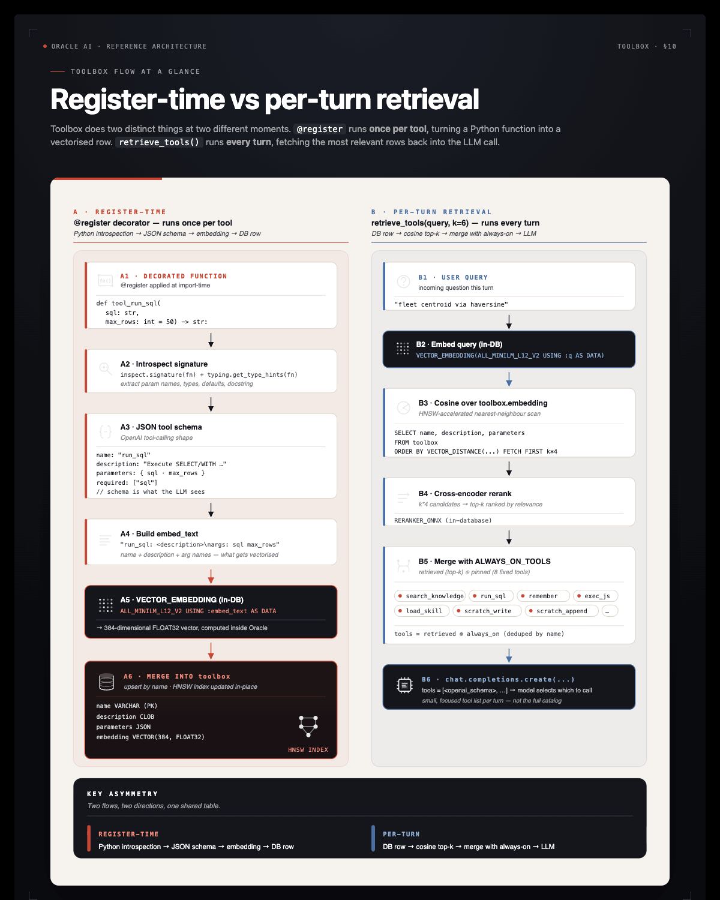
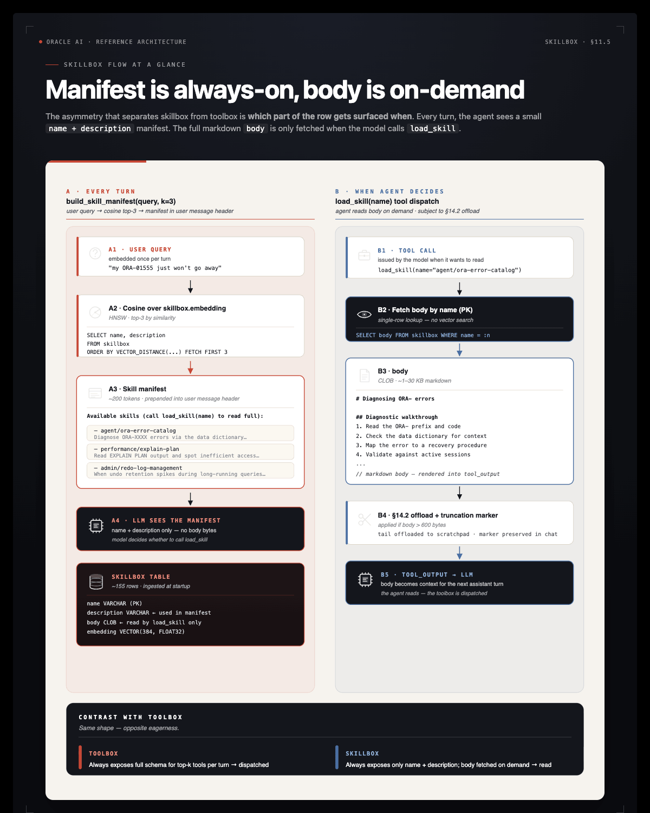

# Part 6: Tools & Skills

The agent needs a way to *do things* in the world — execute SQL, run code, write to a scratchpad, fetch a document. In this harness:

| Concept | Lives in | Consumed as |
|---|---|---|
| **Tool** | `toolbox` table (vector-indexed) | OpenAI-style function call, dispatched by the loop |
| **Skill** | `skillbox` table (vector-indexed) | Prose markdown the model reads on demand |

Both use the same retrieval primitive — vector search over an in-database HNSW index — but they are surfaced differently. Tools are *dispatched* (the loop runs them); skills are *read* (the loop inlines a manifest, the model decides whether to load the body).

## Why Vector-Indexed Tools?

If the registry has 6 tools, it'''s harmless to put them all in every LLM call. Once you have 30+ tools (per-system MCP servers, per-team helpers), the model starts confusing them and the per-turn token bill grows linearly with the registry. Indexing tools by an embedding of `name + description + arg names` lets us pass *only the relevant top-k* for a given user query.

We still always include a small **always-on** set — `run_sql`, `search_knowledge`, `remember`, `exec_js`, `load_skill` — they'''re cheap and the agent calls them on almost every turn.



## The `@register` Decorator

Pre-built. Read it before doing the TODO. The decorator is **argument-less** — `@register` introspects the function and writes both the in-memory entry and the `toolbox` row.

```python
def register(fn):
    """Argument-less decorator: name from __name__, description from __doc__,
    parameters schema from the signature + type hints. Embedding for the
    `toolbox` row is computed in-DB via VECTOR_EMBEDDING — no Python-side
    embedder, no network call."""
    name, description, parameters, openai_schema = _build_schema(fn)
    TOOLS[name] = (fn, openai_schema)

    arg_text = " ".join(parameters["properties"].keys())
    embed_text = f"{name}: {description}\nargs: {arg_text}"

    with agent_conn.cursor() as cur:
        cur.execute(
            "MERGE INTO toolbox t USING (SELECT :tn AS n FROM dual) s ON (t.name = s.n) "
            "WHEN MATCHED THEN UPDATE SET description = :td, parameters = :tp, "
            f"  embedding = VECTOR_EMBEDDING({ONNX_EMBED_MODEL} USING :etext AS DATA), "
            "  updated_at = CURRENT_TIMESTAMP "
            "WHEN NOT MATCHED THEN INSERT (name, description, parameters, embedding) "
            f"  VALUES (:tn, :td, :tp, VECTOR_EMBEDDING({ONNX_EMBED_MODEL} USING :etext AS DATA))",
            tn=name, td=description, tp=json.dumps(parameters), etext=embed_text,
        )
    agent_conn.commit()
    return fn
```

Three things happen:

1. **Introspection** — `_build_schema(fn)` reads `fn.__name__`, `fn.__doc__`, and the type hints to produce an OpenAI-compatible `function` schema.
2. **Embedding in SQL** — `VECTOR_EMBEDDING(ALL_MINILM_L12_V2 USING :etext AS DATA)` runs *inside* the database. No Python embedder.
3. **MERGE** — re-running `@register fn` updates the row in place. Re-defining a tool is a one-line change.

The `_build_schema` helper requires every tool to have a docstring — without one, retrieval would have nothing to embed. **Always write a docstring.** It is the tool'''s public spec.

## TODO 4: Register `tool_run_sql`

`run_sql` is the agent'''s primary way to query live data. It must be **read-only** — `SELECT` and `WITH` only, no DDL, no DML. The agent shouldn'''t be able to `DROP TABLE` even if a hostile prompt asks it to.

The `_READ_ONLY` regex is pre-defined:

```python
_READ_ONLY = re.compile(r"^\s*(select|with)\b", re.IGNORECASE)
```

**Your job:** decorate a function `tool_run_sql(sql: str, max_rows: int = 50) -> str` with `@register`. The function:

1. Rejects any statement that doesn'''t match `_READ_ONLY`.
2. Executes the SQL on `agent_conn`.
3. Returns up to `max_rows` rows as JSON: `{"columns": [...], "rows": [...], "row_count": N}`.
4. On any database error, returns `{"error": "..."}`.

CLOB columns need special handling — `v.read() if hasattr(v, "read") else v` for each cell.

**Solution:**

```python
@register
def tool_run_sql(sql: str, max_rows: int = 50) -> str:
    """Execute a READ-ONLY SQL statement (SELECT/WITH only) against the target Oracle AI Database
    and return up to `max_rows` rows as JSON. Reject any statement that isn'''t read-only.
    """
    if not _READ_ONLY.match(sql.strip()):
        return json.dumps({"error": "only SELECT / WITH statements are allowed in run_sql"})
    try:
        with agent_conn.cursor() as cur:
            cur.execute(sql)
            cols = [d[0] for d in cur.description]
            rows = []
            for i, r in enumerate(cur):
                if i >= max_rows:
                    break
                rows.append([(v.read() if hasattr(v, "read") else v) for v in r])
        return json.dumps({"columns": cols, "rows": rows, "row_count": len(rows)},
                          default=str)
    except Exception as e:
        return json.dumps({"error": str(e)})
```

Notice three things:

- **The docstring is the tool description.** It tells the LLM *when* to call this tool, not just *how*. Prefer "Use this when..." phrasing.
- **`json.dumps(..., default=str)`** handles `datetime`, `Decimal`, etc. that aren'''t JSON-native. Without this, dates raise `TypeError`.
- **Error handling returns JSON.** The LLM reads the tool output as a string; an error in JSON form is something it can react to ("the column doesn'''t exist, let me check the schema").

After this cell runs, `tool_run_sql` is in the `TOOLS` registry and a row in the `toolbox` table.

## The Toolset (Pre-Built)

The notebook registers these tools beyond `tool_run_sql`:

| Tool | What it does |
|---|---|
| `scan_database(owner)` | Run the §2 scanner against a schema; append facts to OAMP. |
| `search_knowledge(query, k, kinds)` | Semantic search over the agent'''s long-term memory. |
| `exec_js(code)` | Run JavaScript inside Oracle MLE — deterministic compute the LLM shouldn'''t do in its head. |
| `scratch_write(path, content)` / `scratch_read(path)` / `scratch_append(path, content)` | DBFS scratchpad I/O. |
| `remember(subject, body, kind)` | Persist a correction or learning into memory. |
| `load_skill(name)` / `list_skills(query)` | Read a prose playbook from the skillbox. |

You'''ll see the agent dispatch most of these in §5'''s end-to-end demo.

## Skills: Procedural Memory for *How* to Do Things

The §10 toolbox answers *"what can the agent call?"* — function specs, dispatched as `tool_calls`. The **`skillbox`** answers a different question: *"what does the agent know how to do?"* — prose playbooks the model reads as part of its context.

Two procedural-memory tables, parallel structures:

| | `toolbox` | `skillbox` |
|---|---|---|
| Holds | Callable function specs | Prose markdown playbooks |
| Consumed as | `tools=[...]` parameter — dispatched | Text in context — read |
| Per-turn injection | Top-k schemas + always-on | Top-k *names + 1-line desc* (manifest) |
| Full content | n/a (functions just run) | `load_skill(name)` returns the body |



**Source: [`oracle/skills/db`](https://github.com/oracle/skills/tree/main/db).** Oracle publishes a curated library — 100+ guides organized by category (`agent`, `performance`, `security`, `plsql`, `sqlcl`, …). Each `.md` file is a skill: an H1 title, a first-paragraph description, and a body of prose + SQL examples.

The pre-built ingestion cell mirrors them into `skillbox` with their content SHA so re-ingestion is idempotent. `~155 skills × ~5 KB → 15 KB per turn` if we always-injected — far too much. Instead:

- The **manifest** (top-3 skill names + descriptions, ~200 tokens) is prepended to every prompt by `build_skill_manifest`.
- The **full body** is one `load_skill(name)` tool call away.

The model sees the menu without paying for the meal.

## Key Takeaways — Part 6

- **Tools are Python callables with embeddings.** The `@register` decorator introspects the function and writes a vector-indexed row. Function name + docstring + arg names *are* the public spec.
- **Vector retrieval keeps the prompt lean.** With 30+ tools, including all of them every turn confuses the model. Top-k by cosine over the user query exposes only what'''s relevant — registry size grows without per-turn cost growing.
- **Always-on vs retrieved.** Cheap-and-frequent tools (`run_sql`, `search_knowledge`, `remember`, `load_skill`) ship in every prompt. Specialised tools come from the toolbox lookup.
- **Tools answer "what can I call?". Skills answer "what do I know how to do?".** Tools are dispatched as function calls; skills are prose playbooks the model reads.

## Troubleshooting

**`ValueError: tool '"'"'tool_run_sql'"'"' has no docstring`** — The `_build_schema` helper requires a docstring. Add one.

**`@register` raises `ORA-51962`** — The HNSW vector index couldn'''t be created. Check `vector_memory_size` and bounce the DB if needed (see [Part 1](part-1-setup.md)).

**`@register` succeeds but `retrieve_tools` returns empty results** — Run the cell that registers tools first. Without rows in `toolbox`, vector search has nothing to retrieve.
