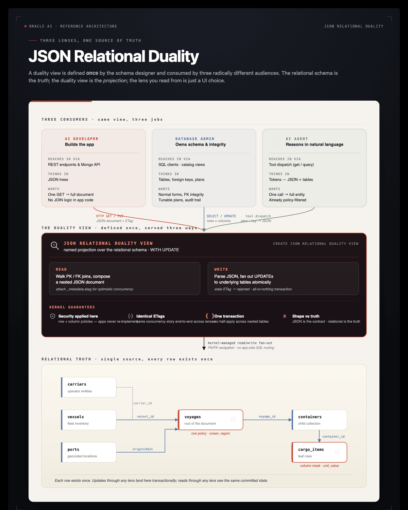

# Part 9: JSON Relational Duality Views

> **Documentation:** [`Creating Duality Views`](https://docs.oracle.com/en/database/oracle/oracle-database/26/jsnvu/creating-duality-views.html)

Part 6 gave the agent a vector-indexed `toolbox` (dispatchable functions). Part 7 layered the agent loop on top. **Part 9 adds a third procedural-memory shape: document-shaped reads of the relational schema** via Oracle 23ai/26ai's JSON Relational Duality Views.

A duality view is a JSON projection over a set of tables joined by PK/FK/UK relationships. The same row in `voyages` is accessible as a **relational tuple** *and* as a **nested JSON document** that includes its `vessel`, `carrier`, `origin` / `destination` ports, and the array of `containers` (with their `cargo_items` nested inside). One read, no JOINs, no client-side reshaping.



## Why this matters for an LLM agent specifically

GPT-class models reason about JSON markedly better than they reason about tabular join results. Every time the agent asks *"tell me everything about voyage 7"*, the choice today is: write a 4-table JOIN, parse the rows, mentally reassemble the document. With a duality view the agent runs:

```sql
SELECT JSON_SERIALIZE(data PRETTY) FROM voyage_dv WHERE JSON_VALUE(data, '$._id') = 7
```

and gets the document back already shaped. Fewer tool turns, fewer hallucinated columns.

## Why this matters for the harness specifically

## The two duality views

| View | Shape | When the agent reaches for it |
|---|---|---|
| `voyage_dv` | voyage → vessel → carrier; voyage → origin/dest port; voyage → containers[] → cargo_items[] | Whole-voyage queries: *"what's on voyage X?"*, *"all cargo bound for Rotterdam"* |
| `vessel_dv` | vessel → carrier; vessel → current position | Fleet/vessel queries: *"where is vessel Y?"*, *"which Maersk vessels are at sea?"* |

Both are read-only — no `WITH UPDATE` clause, so DML through them is rejected by the kernel.

## TODO 7: Register `tool_get_document`

Read one full document from a duality view by primary key. The agent calls this instead of writing JOINs whenever it needs the full shape of an entity.

`view` must be one of `voyage_dv` / `vessel_dv`. `key` is the value of the document `_id`. Return the JSON document as a string, or a JSON `{"error": ...}` if the view name is unknown or no document matches.

The query you need:

```sql
SELECT JSON_SERIALIZE(data PRETTY) FROM SUPPLYCHAIN.{view} WHERE JSON_VALUE(data, '$._id') = :k
```

Bind `key` as an integer when it parses as a digit, otherwise as a string.

**Solution:**

```python
@register
def tool_get_document(view: str, key: str) -> str:
    """Read one full document from a JSON Relational Duality View by primary key.
    Use this instead of writing JOINs whenever you need the full shape of an entity
    (a voyage with its vessel/carrier/ports/containers/cargo, or a vessel with its
    carrier/position). Returns a JSON document.

    `view` must be one of: voyage_dv, vessel_dv.
    `key` is the value of the document _id (numeric voyage_id or vessel_id, as a string).
    """
    allowed = {"voyage_dv", "vessel_dv"}
    if view not in allowed:
        return json.dumps({"error": f"unknown view {view!r}; allowed: {sorted(allowed)}"})
    try:
        with agent_conn.cursor() as cur:
            cur.execute(
                f"SELECT JSON_SERIALIZE(data PRETTY) FROM {DEMO_USER}.{view} "
                f" WHERE JSON_VALUE(data, '$._id') = :k",
                k=int(key) if str(key).isdigit() else key,
            )
            row = cur.fetchone()
        if not row:
            return json.dumps({"error": f"no document with _id={key} in {view}"})
        body = row[0].read() if hasattr(row[0], "read") else str(row[0])
        return body
    except Exception as e:
        return json.dumps({"error": f"{type(e).__name__}: {e}"})
```

`tool_query_documents(view, where, max_rows)` — for filtering a duality view with a SQL predicate — is pre-built right after this TODO.


## Writable views with ETag-based concurrency

The pre-built `voyage_status_dv` adds `WITH UPDATE` to the DV definition. That makes the view writable — `UPDATE voyage_status_dv SET data = …` writes back to the underlying tables, atomically.

Two pieces make that safe in a multi-writer world:

| Piece | Purpose |
|---|---|
| `WITH UPDATE` clause | Tells the kernel the view is writable; without it, `UPDATE` raises `ORA-42692` |
| `_metadata.etag` field on every retrieved document | Optimistic concurrency. Stale writes raise `ORA-42699` |

This is the same model HTTP uses for `If-Match` headers — but enforced **inside the database**, by the SQL engine, on every UPDATE through the view. No application-layer locking, no `SELECT … FOR UPDATE` fan-out, no client-side cache reconciliation logic.

The notebook demos:

1. **Round-trip:** read a voyage doc, flip `status`, PUT back with the matching ETag. Verifies the ETag rotates atomically.
2. **Conflict:** two readers grab the same doc. First writer commits; second writer's ETag is now stale and the kernel raises `ORA-42699`.

## Why we don't expose the writable path to the agent

The harness keeps `tool_run_sql` SELECT-only and there's no `tool_update_document`. Adding one would re-open the write path we closed — a hostile prompt could rewrite voyage status or cargo manifests. The cells below are SQL-level demonstrations of the duality mechanic, not agent capabilities. If you decide to give your agent narrow write authority later (e.g., status updates only, gated by an identity check), this is the foundation you'd build on.

## Key Takeaways — Part 9

- **One row, two equally-valid shapes.** A duality view serves the SAME data as a relational tuple AND a JSON document — kernel-managed, no app-layer mapping. The relational schema is the truth; the JSON shape is the contract.
- **Three personas, one source.** A DBA, an AI developer, and an AI agent all consume the same row through their preferred lens (SQL, REST/JSON, tool dispatch). Defining the projection once kills the per-consumer mapping code.
- **Writable views need `WITH UPDATE`.** Without it, `UPDATE …` raises `ORA-42692`. With it, you get server-side optimistic concurrency for free — every doc carries `_metadata.etag`, stale writes raise `ORA-42699`.

## Troubleshooting

**`ORA-00900` / `ORA-02000` on `CREATE OR REPLACE JSON RELATIONAL DUALITY VIEW`** — Your Oracle image predates duality view support. Confirm with `SELECT BANNER_FULL FROM v$version`. Duality views require Oracle 23ai or later.

**`ORA-42699: can't update through duality view because the document's etag is out of date`** — Expected in the conflict demo. In real code, the second writer would re-read the row, re-apply its change, and retry.

**`ORA-42692: cannot UPDATE/DELETE through duality view`** — The view is read-only (no `WITH UPDATE` clause). Either change the view or use the underlying table.
